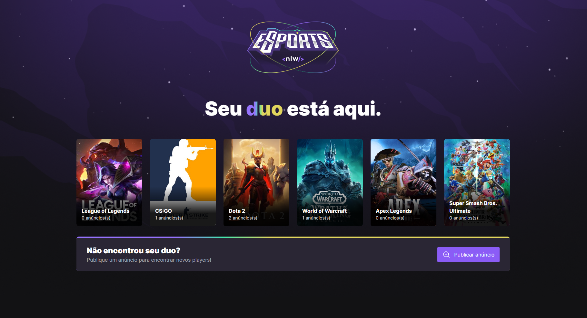
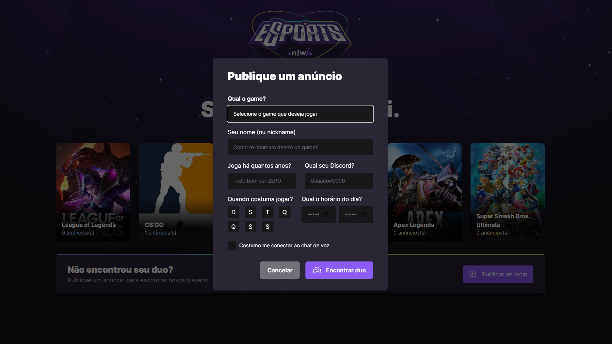
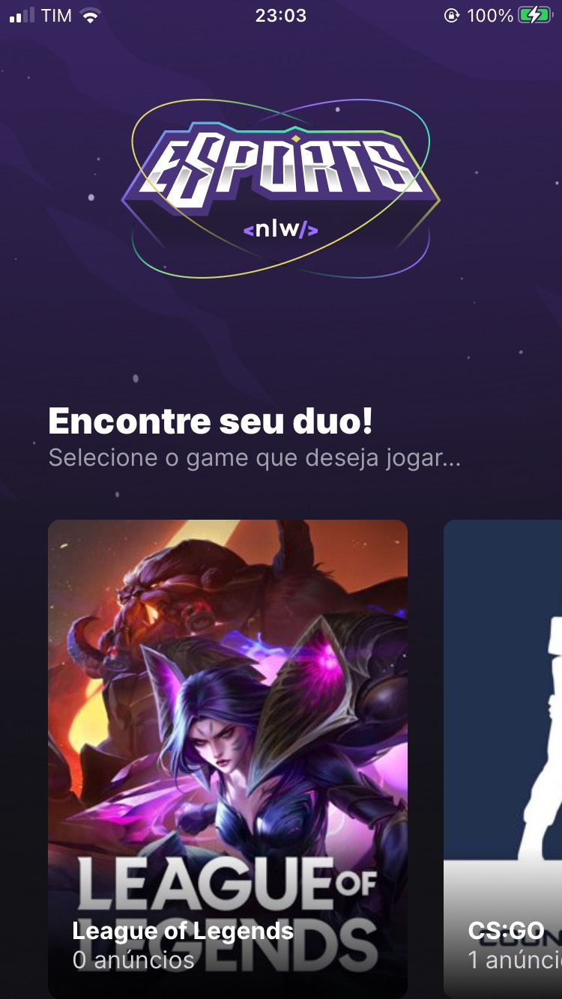
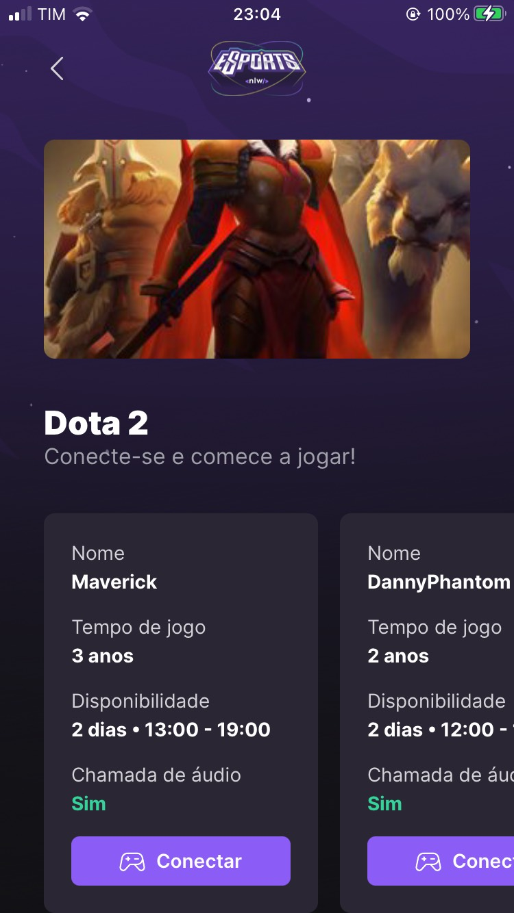
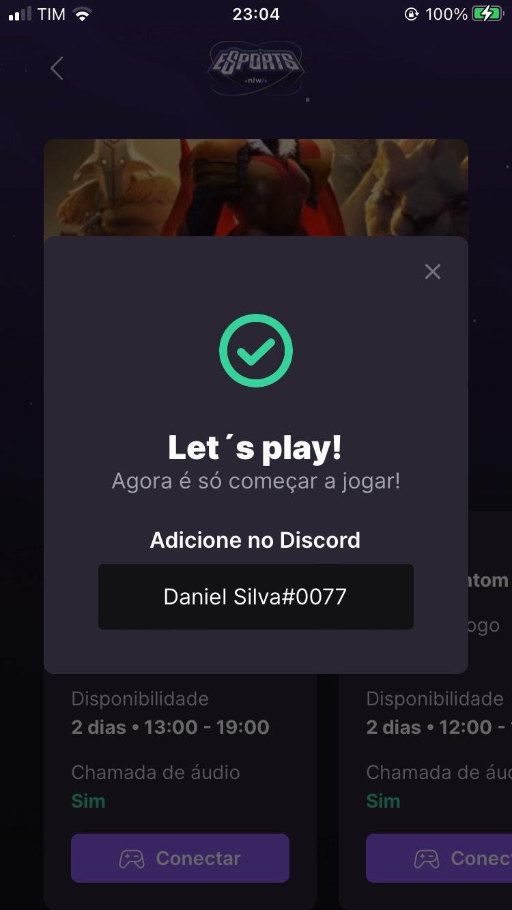

<div align="center">

  
  <h1><strong> Find Your Duo </strong></h1>
  
  
  
  

  **Uma projeto muito bancana pros gamers encontrarem parceiros de jogatina nos jogos que quiserem.**
  
  **Projeto feito na edição nlw Esports da rocketseat.**
  <div style="display: flex;">
    <h3>Web</h3>
    
    
  </div>
  <div style="display: flex;">
    <h3>Mobile</h3>
    
    
    
  </div>
</div>

<h2> 📚 About</h2>

O <i>Find your Duo</i> se trata de uma aplicação o usúario pode procurar um outro jogador para jogarem juntos.

Com a publicação de um anúncio para o game que o usúario especificar, outros usúarios que estão procurando um

parceiro para jogar, podem visuzalizar esse anúncio e conectar com o discord do publicador do anúncio pegando o 

seu nome de usúsario do discord e assim, formarem uma dupla(duo). 🎮

Esse projeto é composto de um frontend web, frontend mobile e backend. ⚙

Nessa versão, na interface web o usúario pode publicar anúncios e escolher o game. 💻

Na interface mobile o usúario pode escolher o game e visualizar os anpuncios publicados para esse game. 📱

As duas interfaces são integradas ao backend por REST API. O backend é conectado ao banco de dados SQLite. 🖥

<h2> 🛠 Tecnologias </h2>

- ⚛️ ReactJS
- ⚛️ React Native
- 🆙 TypeScript
- 🌫️ Tailwind
- 📲 Expo
- 🟢 NodeJS
- 🛤️ Express
- 💾 Banco de dados SQLite

<h2> 📑 Features Frontend Web </h2>

- Divisão dos anúncios por game.(games exibidos ainda não mostram os anúncios)
- Publicação de anúncios.
- Os games são carregados dinâmicamente do banckend.
- Interface intuitiva.

<h2> 📑 Features Frontend Mobile </h2>

- Divisão dos anúncios por game.
- Exibição do cotêiner do anúncio com todas as infos do usúario que publicou.
- Modal para pegar o nick do discord do usúario que publicou.
- Os games e anúncios são carregados dinâmicamente do backend.
- Interface intuitiva.

<h2> 📑 Features Backend </h2>

- Criação das entidades no banco de dados.
- Criação de recurso para retornar a lista de games.
- Criação de recurso para retornar a lista de anúncios por game.
- Criação de recurso para criar um anúncio por game.
- Criação de recurso para retornar o discord informado no anúncio especificado.

<h2> 💡 O que eu aprendi </h2>

- [x] Conceitos do ReactJS
- [x] Conceitos do React Native
- [x] Criar um projeto react com o npm e vite
- [x] Biblioteca tailwind e o postcss.
- [x] Detalhes de implementação do typescript no react e react native.
- [x] Ferramenta Prisma.
- [x] Conceitos da biblioteca Express do nodeJs.
- [x] Criar um projeto react native com o expo.
- [x] Ferramenta Expo.
- [x] Como estruturar um projeto react.
- [x] Como estruturar um projeto react native.

<h2> 🔥 Começando a usar </h2>

**Node (NPM)**
```
npm install
npm run dev
```
**Yarn**
```
yarn
yarn dev
```

**Expo (Mobile)**
```
expo install
expo start
```

<h2> ⚙ Pré-requisitos </h2>

Para executar o frontend web e o backend deste projeto você deve ter [Nodejs](https://nodejs.org/) instalado em sua máquina para ter acesso ao NPM. 
É reconmendavel a partir da versão 15.**.

O gerenciador de pacotes [Yarn](https://yarnpkg.com/) é opcional. Baseado no NPM, é um pouco diferente em alguns fatores, melhorando alguns problemas que o NPM teria. Mas pode optar por usar o NPM sem problemas.

Para executar o frontend mobile deste projeto você deve ter o [Expo](https://expo.dev/) instalado em sua máquina.

<h2> 🤝🏼 Contribuições </h2>

Qualquer contribuição que fizerem será muito bem-vinda.

1. 🍴 Fork the Project
2. 👯 Clone this project (`git clone https://github.com/Daniels-hc/dsmeta.git`)
3. 🔀 Create your Feature Branch (`git checkout -b my-feature`)
4. ✔️ Commit your Changes (`git commit -m 'feat: My new feature'`)
5. 📌 Push to the Branch (`git push origin my-feature`)
6. 🔁 Open a Pull Request

<h2> 📫 Contact </h2>

 [](https://www.linkedin.com/in/daniel-silva-63ab81203/)&nbsp;
  [](daniels.dev7@gmail.com)

<!--
# 📜 License
This project is under **MIT License**. Check `LICENSE` for more details.
-->


[reactjs]: https://reactjs.org/
[nodejs]: https://nodejs.org/
[yarnjs]: https://yarnpkg.com/
[linkedin-shield]: https://img.shields.io/badge/-Daniel_Silva-black.svg?e&logo=linkedin&colorB=0077b4
[linkedin-url]: https://www.linkedin.com/in/daniel-silva-63ab81203
[version-1-shield]: https://img.shields.io/badge/-1.0-5965E0
